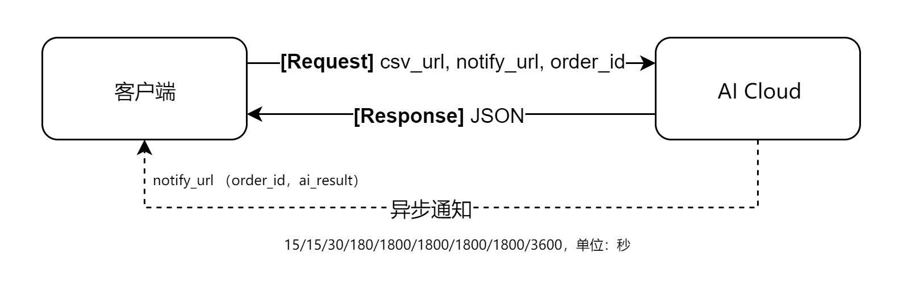

# ai-cloud
biod lab, biomedical artificial intelligence cloud


| 诊断类型                    | 版本 | 请求地址                                 |
| --------------------------- | ---- | ---------------------------------------- |
| 心电诊断 / 深度学习 / 2分类 | v1   | http://ai.biodwhu.cn/ecg/dl/classify2/v1 |
| 心电诊断 / 深度学习 / 4分类 | v1   | http://ai.biodwhu.cn/ecg/dl/classify4/v1 |
| 心电诊断 / 机器学习/ 4分类  |      | http://ai.biodwhu.cn/ecg/ml/classify4/v1 |


## 1. 心电诊断 / 深度学习 / 2分类_v1



### 第一步：客户端调用

请求类型：`POST`

请求地址：http://ai.biodwhu.cn/ecg/dl/classify2/v1

请求参数：

- `csv_url`（或是通过 form 表单方式直接提交文件）：http://file.biodwhu.cn/xxxxxxxxxxxx.csv
- `notify_url`：http://api.biodwhu.cn/ecg/dl/classi4/v1/reback
- `order_id`：ECG-121223423412121231

返回结果：

```json
{
    "code":200
    "msg":"请求成功",
    "ai_cloud_id":"23345412233423458998"
}
```


### 第二步：ai-cloud 诊断

1. 下载文件
2. 调用 tensorflow 诊断
3. 出结果


### 第三步：服务端回调客户端提供的URL，返回结果给用户

请求方式：POST

请求地址：http://api.biodwhu.cn/ecg/dl/classi4/v1/notify

请求参数：

- `order_id`：ECG-121223423412121231
- `ai_result`："{'label':'正常','prob':'0.97'}"

回调成功：

```
SUCCESS_REBACK
```


重试机制：

后台通知交互时，如果后台收到商户的应答不符合规范或超时，后台会判定本次通知失败，重新发送通知，直到成功为止（在通知一直不成功的情况下，总共会发起 10 次通知，每次通知时间距离最近一次的间隔为15/15/30/180/1800/1800/1800/1800/3600，单位：秒），但不保证通知最终一定能成功。


请参考微信支付回调：

https://pay.weixin.qq.com/wiki/doc/api/app/app.php?chapter=9_7&index=3


## 2. 心电诊断 / 机器学习 / 4分类_v1


